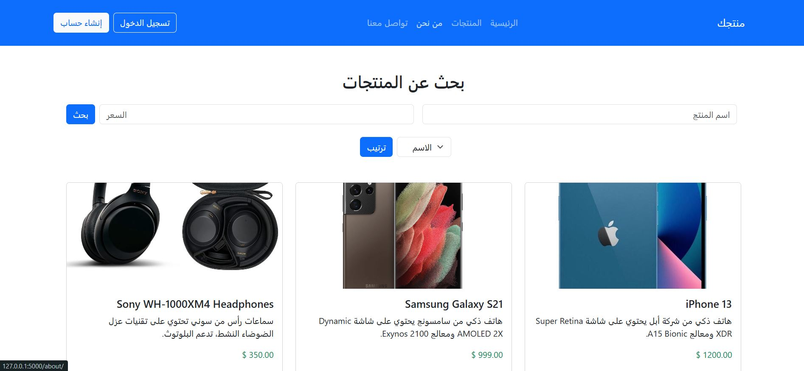
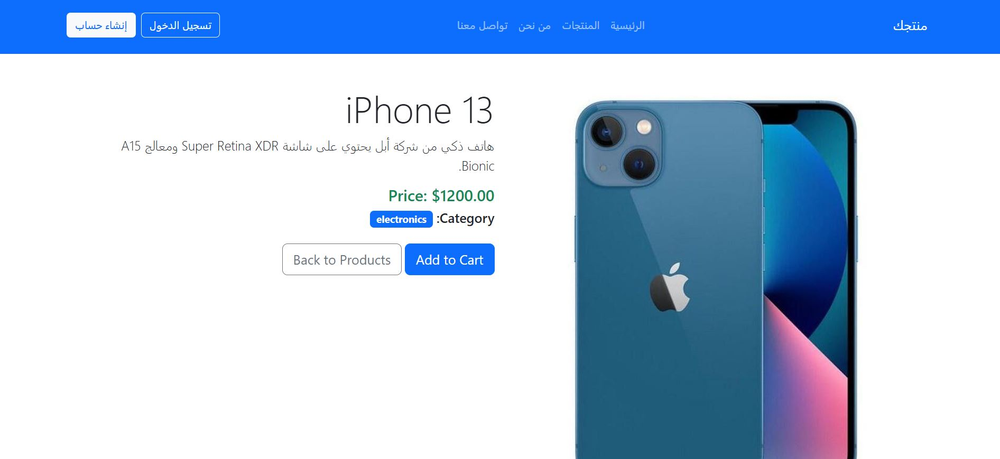
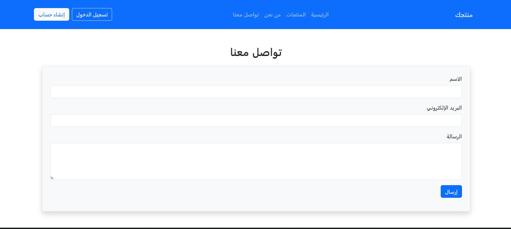
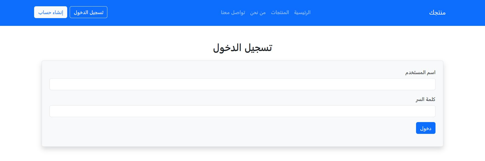
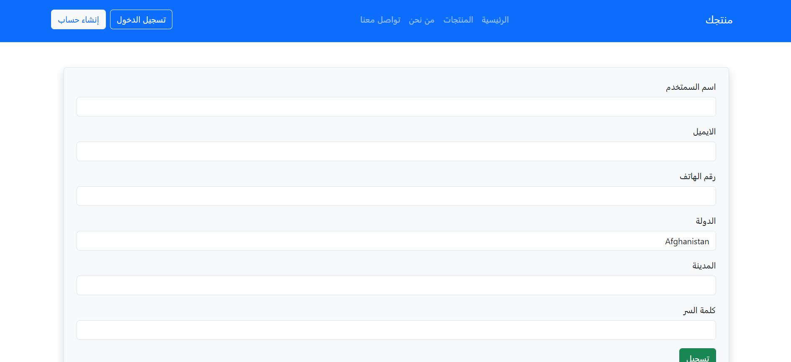

# 🛒 Store Website - Django + Django REST Framework

This is a backend e-commerce API project built using **Django** and **Django REST Framework**. It provides a RESTful interface for managing products, categories, users, and orders.

---

## 🔧 Tech Stack

- [Django](https://www.djangoproject.com/)
- [Django REST Framework](https://www.django-rest-framework.org/)
- SQLite (default, changeable)
- HTML5
- CSS3
- JavaScript (vanilla)

---

## 🚀 Features

- Product CRUD operations
- Categories
- User registration & authentication (Token or JWT)
- Search, filter, and ordering
- Pagination support
- Admin panel for managing models

---

## 📸 Screenshot of UI

---

